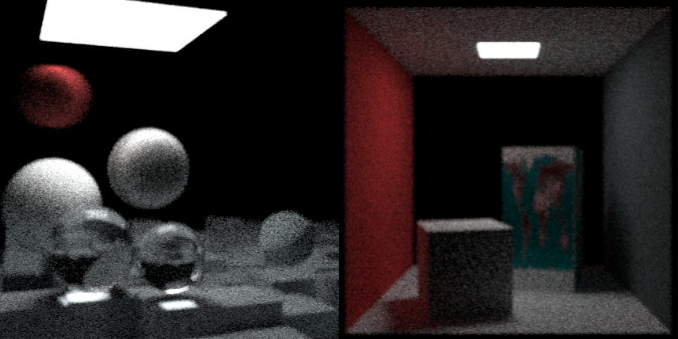

<p align="center">
    
    <p align="center">🎥 Simple, multithreaded, extensible raytracing engine written in C++17</p>
    <p align="center">
        
        
        
    </p>
</p>

## Preview

<p align="center">
    
</p>

## Dependencies

* [stb_image.h](https://github.com/nothings/stb) - image loading

## Installation

### Building from source

```bash
# Recursively clone the repository to get all submodules
$ git clone --recurse-submodules https://github.com/EXLER/EXray

# Create build directory and build project
$ mkdir EXray/build/ && cd EXRAY/build/
$ cmake .. && make
```

## Usage

```bash
$ ./exray
```

If you want to convert the output PPM file, use [ImageMagick](https://imagemagick.org/index.php)
```bash
$ magick image.ppm image.png
```

## Credits

Based on the [Ray Tracing in One Weekend](https://raytracing.github.io/) book series.

## License

Copyright (c) 2020-2021 by ***Kamil Marut***

`EXray` is under the terms of the [MIT License](https://www.tldrlegal.com/l/mit), following all clarifications stated in the [license file](LICENSE).
